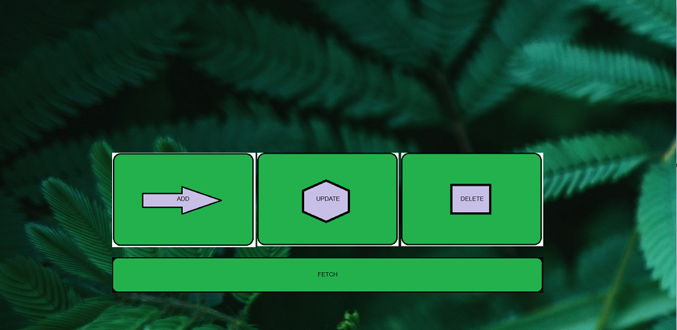

# flaskapp-mongodb

A simple webapp to demonstrate flask and mongoDB integration



## Installation 

### mongoDB on Amazon Linux 2:

Create a /etc/yum.repos.d/mongodb-org-4.4.repo file so that you can install MongoDB directly using yum:

```
[mongodb-org-4.4]
name=MongoDB Repository
baseurl=https://repo.mongodb.org/yum/amazon/2/mongodb-org/4.4/x86_64/
gpgcheck=1
enabled=1
gpgkey=https://www.mongodb.org/static/pgp/server-4.4.asc
```

now  do:

```
sudo yum install -y mongodb-org
```

Complete installation guid -> [link](https://docs.mongodb.com/manual/administration/install-community/)

install `pymongo`and `flask` by 

```
pip install pymongo
```

```
pip install Flask
```

## Usage

From the terminal create the Database and collection by:

```
use <data-base name>
db.createCollection("<collection-name>")
```

Use the `ADD`, `UPDATE`, `DELETE` and `FETCH`to do the required operations.
